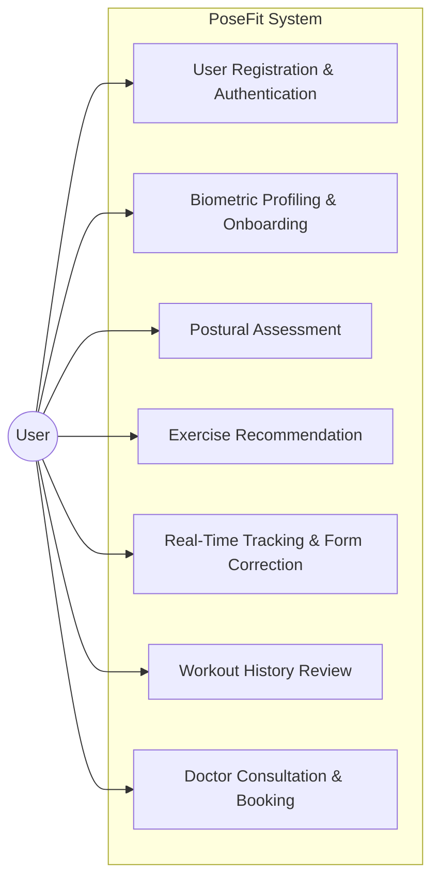
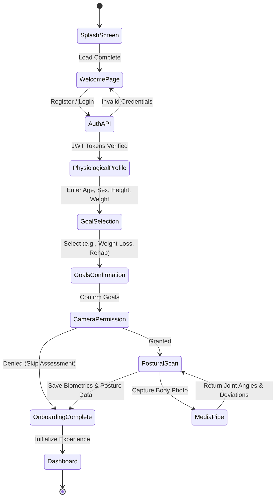
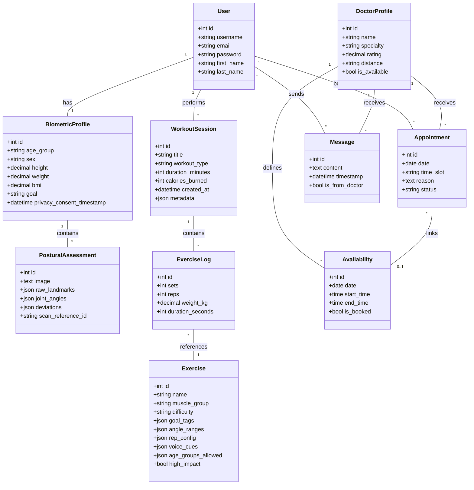
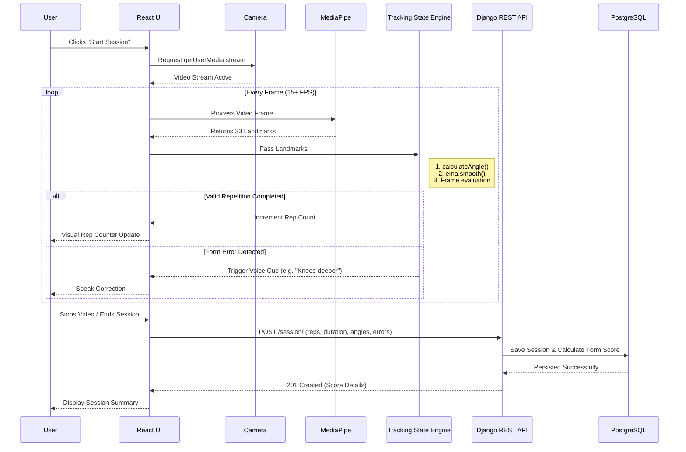

# PoseFit — System Diagrams

This document contains all the diagrams mentioned in the final report, formatted using **Mermaid.js**. If you are using VS Code, you can view these by installing the "Markdown Preview Mermaid Support" extension, or simply by using GitHub's native Markdown viewer.

## 1. Use Case Diagram (Functional Requirements)



## 2. Activity Diagram (Onboarding Flow)



## 3. Class Diagram (Data & Object Modeling)



## 4. Sequence Diagram (Real-Time Exercise Tracking)



## 5. Component Diagram

```mermaid
flowchart TD
    subgraph Client [Client-Side (React)]
        UI[React UI Components]
        State[Zustand Stores]
        Tracker[Tracking Engines: Curl, Squat, Tree]
        Smoothing[EMA Smoothing / Math]
        APIClient[Axios API Services]
    end

    subgraph Browser [Browser APIs]
        Cam[getUserMedia API]
        TTS[Web Speech API]
        WASM[MediaPipe WASM Runtime]
    end
    
    subgraph Server [Backend System (Django/DRF)]
        Router[URL Routing]
        Auth[SimpleJWT Auth]
        Views[REST Views]
        Algos[Algorithms: Cosine Sim, Scoring]
        ORM[Django ORM]
    end
    
    subgraph DB [Database]
        Postgres[(PostgreSQL)]
    end

    UI --> State
    UI --> Tracker
    Tracker --> Smoothing
    Tracker --> WASM
    UI --> APIClient
    UI --> Cam
    Tracker --> TTS
    
    APIClient -->|JSON + JWT| Router
    Router --> Auth
    Auth --> Views
    Views --> Algos
    Views --> ORM
    ORM --> Postgres
```

## 6. Deployment Diagram

```mermaid
flowchart TD
    subgraph UserMachine [User Machine / Client Client]
        Browser[Modern Web Browser (Chrome/Edge)]
        Speaker[Speakers/Headphones]
        Webcam[HD Webcam]
        Browser --> Speaker
        Browser --> Webcam
    end

    subgraph FrontendServer [Frontend Environment]
        Vite[Vite Dev Server / Static File Host]
    end

    subgraph BackendServer [Backend Environment]
        Django[Django WSGI Server]
        Middlewares[CORS & Auth Middlewares]
        Django --- Middlewares
    end

    subgraph DataServer [Data Tier]
        Postgres[(PostgreSQL 14+)]
    end

    Browser <==>|Downloads Assets| Vite
    Browser <==>|HTTP/HTTPS REST calls| Django
    Django <==>|SQL Queries / psycopg| Postgres
```
